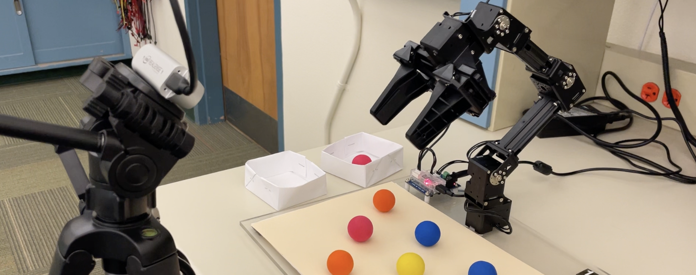

# Vision-Based Manipulation
A step-by-step, learning project for vision-based robotic manipulation with the OpenManipulator-X and Intel RealSense. This repository turns a course-style lab archive into a clean, portfolio-ready roadmap that teaches the fundamentals from kinematics to a full, autonomous sorting system.



**Demo video:** [Watch on YouTube](https://youtu.be/cT57q7G10-s)

## Build
You will implement a complete perception-to-action pipeline:
- Detect colored objects in RGB images.
- Estimate 3D pose from camera data.
- Transform coordinates into the robot frame.
- Solve inverse kinematics.
- Plan smooth trajectories.
- Execute grasp and place actions.

## Pipeline
```
Camera -> Detection -> Pose Estimation -> Frame Transform -> IK -> Trajectory -> Control -> Grasp -> Sort
```

## Principles
- Forward kinematics (FK): map joint angles to end-effector pose using DH parameters.
- Inverse kinematics (IK): recover joint angles from a desired pose, often with multiple solutions.
- Trajectory planning: generate smooth joint or task-space paths with bounded velocity and acceleration.
- Jacobian control: relate joint velocities to end-effector velocities and solve with pseudo-inverses.
- Camera calibration: estimate the rigid transform between camera and robot frames.
- Visual servoing: close the loop by driving robot motion from live vision feedback.

## Frames
This project uses multiple coordinate frames: robot base, end-effector, camera, and AprilTag. The calibration step computes a camera-to-robot transform, which is then used to map detections into the robot base frame. In code, these transforms are handled as 4x4 homogeneous matrices and applied to points and poses throughout the pipeline.

## Hardware
- OpenManipulator-X with Dynamixel XM430 series actuators.
- Intel RealSense D435 RGB-D camera.
- Printed AprilTags for calibration and tracking.
- Colored balls and bins for the final sorting task.

## Software
- Python 3.10+ (tested on 3.11)
- Core packages: `numpy`, `matplotlib`, `opencv-python`, `pyrealsense2`, `pyapriltags`, `dynamixel-sdk`, `pyserial`

## Quick Start
Run scripts from the repository root. Use module execution so imports resolve correctly.

Example:
```bash
python -m steps.step01_robot_basics.s01_robot_bringup
```

If you do not have the hardware connected, you can still run the offline steps (kinematics, trajectory generation, calibration math, plotting) and study the code structure.

## Layout
```
core/                       Shared robotics utilities and hardware wrappers
steps/                      Learning path (6 steps)
assets/                     Logs, images, and calibration artifacts
```

## Core
These are the reusable building blocks used by the learning steps.
- `core/Robot.py`: High-level OpenManipulator-X control, joint IO, Jacobian, and ball detection utilities.
- `core/OM_X_arm.py`: Lower-level arm interface and configuration.
- `core/DX_XM430_W350.py`: Dynamixel register map and constants.
- `core/TrajPlanner.py`: Cubic and quintic trajectory generation utilities.
- `core/MyTrajPlanner.py`: Alternate trajectory planner implementation for comparison.
- `core/Realsense.py`: Intel RealSense D435 wrapper (streaming + intrinsics).
- `core/AprilTags.py`: AprilTag detection and PnP pose estimation utilities.
- `core/PID.py`: Simple PID controller class.

## Assets
- `assets/images/robot.png`: Main project photo.
- `assets/images/image_prelab8.jpg`: Sample image for color-ball detection.
- `assets/images/processed_prelab8.jpg`: Example output from the detection pipeline.
- `assets/calibration/camera_robot_transform.npy`: Example camera-to-robot transform.
- `assets/logs/Part1_data.pkl`: Example trajectory log for plotting.
- `assets/logs/traj_log_20251006_115821.pkl`: Example joint log for analysis.
- `assets/logs/lab_1_data_10s.pk1`: Legacy log from early data collection.

## Steps
Each step is a coherent unit with one or more scripts. Run them in order for the best learning experience.

### Step 01 — Robot Basics
Goal: bring up the robot, read sensors, log data, and analyze sampling quality. Key ideas: joint IO, time-based motion profiles, data logging, and sampling analysis.
- `steps/step01_robot_basics/s01_robot_bringup.py`: Basic robot IO, time-based profiles, and gripper control.
- `steps/step01_robot_basics/s02_joint_readings.py`: Read and visualize joint trajectories over time.
- `steps/step01_robot_basics/s03_joint_logging.py`: Collect joint logs and save them to `assets/logs/`.
- `steps/step01_robot_basics/s04_data_analysis.py`: Plot joint logs and analyze sampling statistics.

### Step 02 — Forward Kinematics
Goal: build a DH-based kinematic model and validate forward kinematics numerically. Key ideas: DH frames, homogeneous transforms, and pose composition.
- `steps/step02_forward_kinematics/s01_dh_fk_model.py`: DH table definition and forward-kinematics computation.
- `steps/step02_forward_kinematics/s02_fk_numeric_checks.py`: Evaluate FK on several joint configurations.
- `steps/step02_forward_kinematics/s03_fk_from_robot_state.py`: Compute FK from live joint readings.

### Step 03 — Inverse Kinematics
Goal: derive and validate a geometric IK solver for the OpenManipulator-X. Key ideas: elbow-up/down solutions, reachability checks, and FK validation.
- `steps/step03_inverse_kinematics/s01_ik_geometric_solver.py`: Baseline geometric IK with two solutions.
- `steps/step03_inverse_kinematics/s02_ik_solver_with_checks.py`: IK with numeric guards and tests.
- `steps/step03_inverse_kinematics/s03_ik_fk_validation.py`: Validate IK by mapping back through FK.
- `steps/step03_inverse_kinematics/s04_ik_on_robot_logging.py`: Execute IK waypoints and log results on hardware.

### Step 04 — Trajectory Planning
Goal: generate smooth joint trajectories and execute them on the robot. Key ideas: cubic interpolation, time parameterization, streaming commands, and log analysis.
- `steps/step04_trajectory_planning/s01_cubic_traj_preview.py`: Generate a short cubic trajectory.
- `steps/step04_trajectory_planning/s02_waypoints_to_joint_traj.py`: Convert task-space waypoints into joint-space trajectories.
- `steps/step04_trajectory_planning/s03_execute_cubic_traj.py`: Stream a trajectory and log joint/EE data.
- `steps/step04_trajectory_planning/s04_plot_trajectory_3d.py`: Plot joint traces and 3D EE paths.
- `steps/step04_trajectory_planning/s05_plot_and_export.py`: Plot and export figures to disk.
- `steps/step04_trajectory_planning/s06_tracking_error.py`: Compute RMS tracking error from logs.

### Step 05 — Control and Calibration
Goal: introduce control fundamentals and compute the camera-to-robot transform. Key ideas: Jacobians, velocity control, PID tuning, and rigid-frame calibration.
- `steps/step05_control_and_calibration/s01_pd_control_sim.py`: PD control simulation for joint dynamics.
- `steps/step05_control_and_calibration/s02_jacobian_singularity_check.py`: Jacobian inspection and singularity detection.
- `steps/step05_control_and_calibration/s03_pid_simulation.py`: PID behavior in a simplified 3-axis model.
- `steps/step05_control_and_calibration/s04_velocity_control_task_space.py`: Velocity control using Jacobian pseudo-inverse.
- `steps/step05_control_and_calibration/s05_velocity_control_with_ik.py`: Velocity control with IK continuity.
- `steps/step05_control_and_calibration/s06_point_registration_kabsch.py`: Kabsch alignment for point registration.
- `steps/step05_control_and_calibration/s07_apriltag_pose_demo.py`: AprilTag detection and pose estimation demo.
- `steps/step05_control_and_calibration/s08_camera_robot_calibration.py`: Compute and save `camera_robot_transform.npy`.
- `steps/step05_control_and_calibration/s09_calibration_validation.py`: Validate the calibration transform.
- `steps/step05_control_and_calibration/pnp_pose_review.md`: PnP pose estimation review notes.

### Step 06 — Visual Servoing and Final Project
Goal: close the loop with vision and build the autonomous sorting system. Key ideas: perception-driven control, coordinate transforms, and full-system integration.
- `steps/step06_vision_servoing_and_project/s01_color_ball_detection.py`: Color-based ball detection on sample images.
- `steps/step06_vision_servoing_and_project/s02_visual_servoing.py`: Position-based visual servoing with AprilTags.
- `steps/step06_vision_servoing_and_project/s03_final_project_sorting.py`: Full pipeline that detects, picks, and sorts balls.

## Final Project
The final script implements a full manipulation loop:
1. Capture RGB frames with RealSense.
2. Detect colored balls via HSV thresholds and Hough circles.
3. Estimate 3D ball pose with PnP.
4. Transform camera coordinates into the robot frame.
5. Plan smooth trajectories with `core/TrajPlanner.py`.
6. Execute pick-and-place motions and sort into bins by color.

## Calibration
The calibration transform lives at `assets/calibration/camera_robot_transform.npy`. If it is missing, run `steps/step05_control_and_calibration/s08_camera_robot_calibration.py` first.

## Starter Notes
Several scripts retain TODOs and placeholders to encourage experimentation and tuning. This is intentional for teaching. The README and comments explain expected behavior and provide hints.

## Safety
Robotic manipulation is inherently risky. Keep the workspace clear, limit speed and torque, and keep an emergency stop nearby when running hardware scripts.

## Legacy
A legacy virtual environment (`venv471/`) is still present from the original coursework and can be ignored or removed if you prefer a clean project.
